<h1 align="center">SkillFoo V3.2 U1</h1>

<p align="center">
  <strong>在冻结评测、安全边界与可审计回滚下，受控演化 <code>SKILL.md</code>。</strong><br>
  A bounded, evidence-driven CLI for evolving AI skills without hiding regressions.
</p>

<p align="center">
  <a href="https://github.com/azbigboss66-oss/skillfoo-v3/actions/workflows/ci.yml"></a>
  <a href="LICENSE"></a>
  
</p>

<p align="center">
  <strong><a href="https://skillfoo-v32-evolution.warm-chub-8493.chatgpt.site/">在线原型</a></strong>
  · <a href="#快速开始">快速开始</a>
  · <a href="docs/U1_CONTRACT.md">U1 合同</a>
  · <a href="https://github.com/azbigboss66-oss/skillfoo-v3/issues">Issues</a>
</p>

SkillFoo 是一个本地实验性 CLI：它冻结 Task Card、评测合同和运行身份，在受限的 `SKILL.md` 编辑面内生成并比较候选，最终写出 public selection、Direct 与条件 sealed 的审计证据。它不会覆盖输入 Skill，也不会自动发布候选；一次合法运行可以正常结束为“保留 Starting Reference”。

> [打开 SkillFoo 在线原型 →](https://skillfoo-v32-evolution.warm-chub-8493.chatgpt.site/)<br>
> 原型用于查看项目流程与案例展示；实际 Skill 演化通过本仓库的本地 CLI 运行。该网站不是在线演化服务，也不是 CLI 或离线测试的依赖。

## 为什么使用 SkillFoo

直接改写一份 Skill 很容易，但很难回答“为什么改、是否真的更好、退步时如何恢复”。SkillFoo 将这些问题放进同一条受控链路：

- **明确意图**：把自然语言目标整理为可确认的 Task Card 与评测边界。
- **保留起点**：冻结原始 B0，并从完整意图生成 S0；两者都不会被候选覆盖。
- **受控演化**：维护 Anchor / Elite / Diversity，通过 exploit / diversify 多代变异和有界精修探索候选。
- **证据化选择**：隔离 public-train 与 terminal public-select，记录候选选择或起点保留决策；该阶段不执行源文件替换。
- **非退化保护**：严格 JSON、deterministic verifier、五维最低线、安全/能力/红线与 critical regression 共同限制冠军资格。
- **隔离对照**：保留同合同 one-shot Direct；它与 Adaptive 上下文隔离，但不构成外部独立评测。只有满足正式前置条件时才进入唯一一次 sealed audit。

## 快速开始

需要 [Node.js](https://nodejs.org/) 20 或更高版本。

```bash
git clone https://github.com/azbigboss66-oss/skillfoo-v3.git
cd skillfoo-v3
npm ci
npm run build
npm test
node dist/cli.js --help
```

安装、构建、测试与帮助命令不需要模型密钥，也不会调用真实 Provider。

### 配置 DeepSeek

Live 执行当前只支持 DeepSeek。真实运行前，在进程环境变量或被忽略的本地 `.env` 中设置 `DEEPSEEK_API_KEY`；可从空值模板 `.env.example` 开始配置。默认模型名来自本地配置，不代表上游账号一定已开放该模型：

```dotenv
DEEPSEEK_API_KEY=<your-key>
DEEPSEEK_BASE_URL=https://api.deepseek.com
DEEPSEEK_MODEL=deepseek-v4-flash
```

不要把真实 Key 写入 `.env.example`、命令参数、结果、日志或 Git 历史。

### 最少输入

一次可进入完整评测链的 instruction-only U1 演化需要：

1. 一个只含待优化指令的 `SKILL.md`；
2. 一份结构化 intake JSON：自然语言目标、至少两个真实场景、至少一条红线、能力边界、五项完整 `intentDetails`，以及可选的质量优先级；
3. 用户在两个不同检查点分别审核 Task Card 与评测摘要，并显式确认。

五项 `intentDetails` 分别是 `goal_and_intended_user`、`inputs_and_evidence`、`output_and_format`、`capability_boundary_and_redlines` 和 `success_criteria_and_protected_behavior`。能力边界需明确 `allowedCapabilities`、`network`、`filesystem` 与 `externalActions`。

`intake --goal ... --interactive` 可以离线澄清五项意图，但不会替用户编造场景或红线，因此它本身不是完整评测链的全部输入。依赖型 Skill 还需要显式提供逐文件 hash 固定的 `runtime-context.v1.json`。references、attachments 与声明式 replay 始终位于候选 root 之外，只是冻结、只读的评测上下文，不会成为变异目标。

## 工作原理

```mermaid
flowchart LR
    A["SKILL.md + 完整意图与场景"] --> B["Task Card"]
    B --> C["人工确认 1"]
    C --> D["评测草案与中文摘要"]
    D --> E["人工确认 2<br/>提交 formal approval lane"]
    E --> V["eval-freeze<br/>contract + holdout + manifest"]
    V --> F["B0 / S0"]
    F --> G["Anchor / Elite / Diversity"]
    G --> H["exploit / diversify<br/>多代变异与精修"]
    H --> I["public-train"]
    I --> J["terminal public-select"]
    J --> K{"全部冠军硬门通过<br/>且 score delta ≥ 3?"}
    K -- "否" --> L["保留 Starting Reference"]
    K -- "是" --> M["记录 Final Public Champion"]
    L --> N["同合同 Direct 对照"]
    M --> N
    N --> O{"sealed 前置条件完整?"}
    O -- "否" --> P["holdout not entered"]
    O -- "是" --> Q["唯一一次 sealed audit"]
```



候选退步只淘汰该候选。terminal public-select 先从 B0/S0 中选择可比较且得分更高的 Starting Reference（同分保留 B0），再从不同 hash 且通过全部冠军硬门的挑战者中选择 public weighted mean 最高者；只有提高至少 3 分时才形成 `clear_improvement`。Direct 不追溯修改已经冻结的 public 决策，sealed 也不会向生成或修复链反馈。

## 完整使用流程

公开命令面包含：`doctor`、`intake`、`eval-draft`、`eval-review`、`eval-freeze`、`bootstrap`、`preflight`、`provider-check`、`calibration-run`、`adaptive-run`、`direct-run`、`audit-compare` 和 `suite-report`。

<details>
<summary><strong>1. Task Card、双确认与冻结合同</strong></summary>

```bash
# 从完整结构化输入生成 Task Card；CLI 不会替用户补造场景或红线
node dist/cli.js intake --from <intake-input.json> --skill-dir <skill-dir> --out <project-dir>

# 用户第一次审核并确认 Task Card
node dist/cli.js intake --confirm <project-dir>/task-card.draft.json --by "<human-reviewer-label>" --out <project-dir>

# 离线生成评测草案、curation 与 sealed-safe 中文摘要
node dist/cli.js eval-draft --task-card <project-dir>/task-card.confirmed.json --out <project-dir>
node dist/cli.js eval-review --dir <project-dir>

# 用户阅读摘要后完成第二次确认，并提交独立 formal-evidence approval lane
node dist/cli.js eval-review --dir <project-dir> --confirm --by "<human-reviewer-label>"

# 在该 formal lane 中写入冻结合同、holdout 与 manifest
node dist/cli.js eval-freeze --dir <project-dir> --adapter instruction-v1
```

正式 live 路径要求两份独立的显式确认记录。CLI 会保存 `--by` 提供的审核者标签，但不提供身份认证；调用者必须确保两次确认确由真实用户在阅读对应内容后完成，不能让模型、Codex、校准结果或 `test-fixture` 冒充。

</details>

<details>
<summary><strong>2. B0/S0、预检与真实运行</strong></summary>

先把原始 `SKILL.md` 原样放入只含这一份普通文件的 `<project-dir>/b0-source/`。bootstrap 会将其冻结为 B0，并从确认后的完整意图生成 S0：

```bash
node dist/cli.js bootstrap --dir <project-dir>/formal-evidence --skill-dir <project-dir>/b0-source --adapter instruction-v1 --out <project-dir>/formal-evidence/bootstrap
```

下列阶段在省略 `--execute` 时不发送 Provider 请求且不写运行结果，但仍会校验完整授权参数；`calibration-run` 当前还会读取 DeepSeek 配置。检查输出后，只有在真实运行时才追加 `--execute`；`--no-release` 表示即使生成候选也不发布：

```bash
node dist/cli.js calibration-run --dir <project-dir> --out <project-dir>/formal-evidence/adaptive --provider deepseek --allow-network --confirm-real-provider I_UNDERSTAND_REAL_PROVIDER_COSTS --no-release --max-retry-attempts 0 --evaluator-request-timeout-ms 120000 --proposer-request-timeout-ms 180000

node dist/cli.js adaptive-run --dir <project-dir> --skill-md <project-dir>/formal-evidence/b0-source/SKILL.md --out <project-dir>/formal-evidence/adaptive --provider deepseek --allow-network --confirm-real-provider I_UNDERSTAND_REAL_PROVIDER_COSTS --no-release --call-envelope-multiplier 2 --max-retry-attempts 2 --evaluator-request-timeout-ms 120000 --proposer-request-timeout-ms 180000 --mode standard --max-generations 2 --max-refinements 2 --max-in-flight 2

node dist/cli.js direct-run --dir <project-dir> --skill-md <project-dir>/formal-evidence/b0-source/SKILL.md --out <project-dir>/formal-evidence/adaptive --strategy one_shot --provider deepseek --allow-network --confirm-real-provider I_UNDERSTAND_REAL_PROVIDER_COSTS --no-release --call-envelope-multiplier 2 --max-retry-attempts 2 --evaluator-request-timeout-ms 120000 --proposer-request-timeout-ms 180000 --mode standard --max-in-flight 2

# 仅在 public-select 形成合格新冠军且其它正式门禁满足时才可能读取 sealed
node dist/cli.js audit-compare --dir <project-dir> --out <project-dir>/formal-evidence/audit --provider deepseek --allow-network --confirm-real-provider I_UNDERSTAND_REAL_PROVIDER_COSTS --no-release --call-envelope-multiplier 2 --max-retry-attempts 2 --evaluator-request-timeout-ms 120000 --proposer-request-timeout-ms 180000
```

上述命令通过显式 `--out` 让 Calibration、Adaptive 与 Direct 共用 `<project-dir>/formal-evidence/adaptive`，并让 conditional audit 写入 `<project-dir>/formal-evidence/audit`；不要依赖命令各自的默认输出目录。依赖型 `reference-v1` 必须在相关命令中显式传入 `--runtime-context <runtime-context.v1.json>`。完整合同、预算与资格语义见 [docs/U1_CONTRACT.md](docs/U1_CONTRACT.md)。

`preflight --dir <project-dir> --skill-md <formal-b0-path>` 专门复用 Adaptive 的正式输入、intake 与预算路径做零调用检查。`provider-check` 不带 `--execute`：一旦完整提供 live 授权参数，它就会发送一次真实连接请求，且只形成 connectivity-only 证据。已有多案例结果可用 `suite-report --suite <suite-dir>` 聚合；该命令不运行演化。

</details>

## 当前能力与限制

- **只优化 `SKILL.md`**：不优化 scripts、references、attachments、插件、网页、数据库或完整 Skill 包。
- **冻结运行上下文**：`reference-v1` 只允许通过声明过的逻辑 ID 读取 hash-bound、只读、零网络上下文；它不授权任意路径、命令或真实外部行动。
- **三层资格**：Comparison baseline、Eligible champion 与 Releaseable candidate 含义不同。“完成但得 0 分”不等于“评测没有完成”，但无效 JSON 或 hard-contract 失败的候选绝不能成为冠军。Releaseable 还需要额外门禁；本仓库描述的正式运行保持 no-release。
- **保留起点是正常结果**：没有合格改进时保留所选 Starting Reference（B0 或 S0），说明非退化保护生效，不代表演化获得成功。
- **Provider 仍有边界**：正式运行当前主要绑定 DeepSeek；本项目尚未实现任意厂商 API 通用化。
- **同模型局限仍存在**：同一模型家族可能承担 proposer、evaluator 与 semantic judge。角色隔离、严格 schema 和 deterministic gates 能降低风险，但不等于独立外部验证或普遍效果证明。
- **发布相互独立**：GitHub 源码公开、npm 发布与生成候选 Skill 的 release 是三种不同操作；本仓库保持 `private: true`，不会自动 push、publish 或 release。

### 数据与隐私

Live 执行会把完成相应阶段所需的任务、候选和评测内容发送给配置的 Provider；“本地 CLI”不代表数据不离机。运行目录还可能包含目标、审核者标签、候选 `SKILL.md`、评分、确认记录和 sealed 材料。`.gitignore` 只是仓库卫生措施，不能阻止外部传输，也不能保护写到其它 `--out` 路径或已经进入 Git 历史的文件。请只使用获准的数据，并在公开前检查暂存区、完整历史和发布包。

## 工程验证与证据边界

仓库配置了零网络单元、合同、主链集成测试，以及安装、构建、全量测试和 CLI-help 工作流。只有公开远端的实际工作流结果才代表该提交的 CI 状态；这些检查证明工程连接和确定性边界，不等于重新证明模型优化效果。public 的 100 分也只表示某一冻结合同上的结果，不是绝对满分。

## 版本

- CLI 软件包版本：`1.0.0`。
- 架构与评测协议：SkillFoo `V3.2 U1`。

两个版本号属于不同层次：前者是软件包版本，后者描述当前只优化 `SKILL.md` 的受控演化架构。

## 贡献、帮助与安全

- 贡献指南：[CONTRIBUTING.md](CONTRIBUTING.md)
- 安全政策：[SECURITY.md](SECURITY.md)
- 当前 U1 合同：[docs/U1_CONTRACT.md](docs/U1_CONTRACT.md)
- 问题与功能建议：[GitHub Issues](https://github.com/azbigboss66-oss/skillfoo-v3/issues)
- 维护者：[@azbigboss66-oss](https://github.com/azbigboss66-oss)

请不要在公开 Issue、PR、测试 fixture 或模型记录中提交 API Key、原始 Provider 响应、真实人工确认、业务附件或 sealed 内容。安全问题请遵循 [SECURITY.md](SECURITY.md) 的私密报告边界。

## 许可证

本项目以 [MIT License](LICENSE) 发布。第三方依赖和内容仍分别遵循各自的许可证与版权声明。
